```{r setup, include=FALSE, cache=TRUE}
library(DESeq2)
library(airway)
library(ggplot2)
library(pheatmap)
library(RColorBrewer)
set.seed(2024)
data("airway")
dds_airway <- DESeqDataSet(airway, design = ~ cell + dex)
dds_airway$dex <- relevel(dds_airway$dex, ref = "untrt")
keep <- rowSums(counts(dds_airway) >= 10) >= 4
dds_airway <- dds_airway[keep, ]
dds_airway <- DESeq(dds_airway)
vsd_airway <- vst(dds_airway, blind = TRUE)
res_airway <- results(dds_airway, name = "dex_trt_vs_untrt")
res_shrunk_airway <- lfcShrink(dds_airway, coef = "dex_trt_vs_untrt", type = "apeglm")
```

## Bioinformatics Support at Yale

\vspace{1.6em}
\begin{columns}
\begin{column}{0.46\textwidth}
\centering
{\normalsize\textcolor{statyale}{\textbf{Bioinformatics Support Hub}}}\\[0.5em]
{\small Computational support for every stage in the omics data lifecycle.}\\[0.8em]
{\scriptsize\textcolor{statsecondary}{\href{https://library.medicine.yale.edu/research-support/bioinformatics/}{library.medicine.yale.edu/\\research-support/bioinformatics/}}}
\end{column}
\begin{column}{0.06\textwidth}
\centering
{\color{statyale!30}\rule{0.4pt}{3.5cm}}
\end{column}
\begin{column}{0.46\textwidth}
\centering
{\normalsize\textcolor{statyale}{\textbf{StatLab Statistical Support}}}\\[0.5em]
{\small Statistical consulting and methods support for Yale researchers.}\\[0.8em]
{\scriptsize\textcolor{statsecondary}{\href{https://library.yale.edu/help-and-research-support/research-support/statlab}{library.yale.edu/help-and-research-support/\\research-support/statlab}}}
\end{column}
\end{columns}

## The Lifecycle of Omics Data Analysis

\vspace{-0.3em}
\begin{center}
\begin{tikzpicture}[
  circ/.style={
    shape=circle, draw=statyale, fill=white, line width=1.2pt,
    minimum size=2.0cm, align=center,
    font=\tiny\bfseries, text=statprimary, inner sep=1pt
  },
  arr/.style={-{Stealth[length=5pt,width=4pt]}, line width=0.9pt, color=statyale!50}
]
  \node[circ] (n1) at (90:2.6cm)  {{\footnotesize 1}\\[2pt]\mdseries Download\\Data};
  \node[circ] (n2) at (30:2.6cm)  {{\footnotesize 2}\\[2pt]\mdseries Data\\Processing};
  \node[circ] (n3) at (330:2.6cm) {{\footnotesize 3}\\[2pt]\mdseries Data\\Analysis};
  \node[circ] (n4) at (270:2.6cm) {{\footnotesize 4}\\[2pt]\mdseries Biomedical\\Significance};
  \node[circ] (n5) at (210:2.6cm) {{\footnotesize 5}\\[2pt]\mdseries Hypothesis\\Narrowing};
  \node[circ] (n6) at (150:2.6cm) {{\footnotesize 6}\\[2pt]\mdseries Upload\\Data};
  \foreach \s/\t in {n1/n2, n2/n3, n3/n4, n4/n5, n5/n6, n6/n1}
    \draw[arr] (\s) -- (\t);
\end{tikzpicture}
\end{center}

## Case Study: Shank3 and Circadian Gene Expression

RNA-seq study examining gene expression in the prefrontal cortex:

\begin{columns}
\begin{column}{0.5\textwidth}
\begin{itemize}
  \item \textbf{Tissue:} Brain --- prefrontal cortex
  \item \textbf{Animal:} Mouse, 9 weeks old
  \item \textbf{Genotype:}
    \begin{itemize}
      \item Shank3$^{\Delta C}$ \quad ($n = 10$)
      \item Wild type \quad ($n = 10$)
    \end{itemize}
  \item \textbf{Condition:}
    \begin{itemize}
      \item Normal home cage (5 per genotype)
      \item 5 hr sleep deprivation (5 per genotype)
    \end{itemize}
\end{itemize}
\end{column}
\begin{column}{0.5\textwidth}
\vspace{0.8em}
This is a \textbf{2 $\times$ 2 factorial design}: two genotypes crossed with two conditions, yielding four groups.
\end{column}
\end{columns}

## Results: Design Shapes What You Find

::: {.columns}

:::: {.column width="58%"}
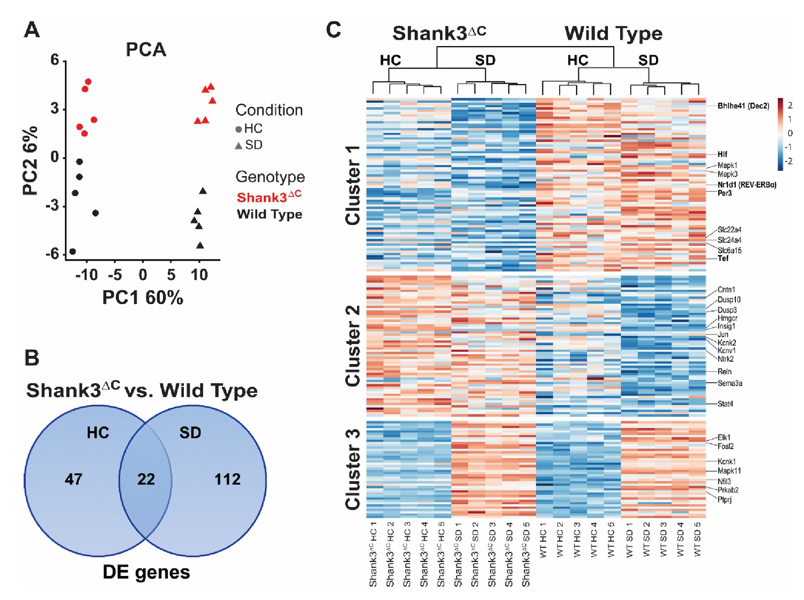
::::

:::: {.column width="42%"}

How does the \textbf{design} of the analysis impact results and interpretation?

\vspace{0.6em}

::::

:::

## Results: Design Shapes What You Find

::: {.columns}

:::: {.column width="58%"}
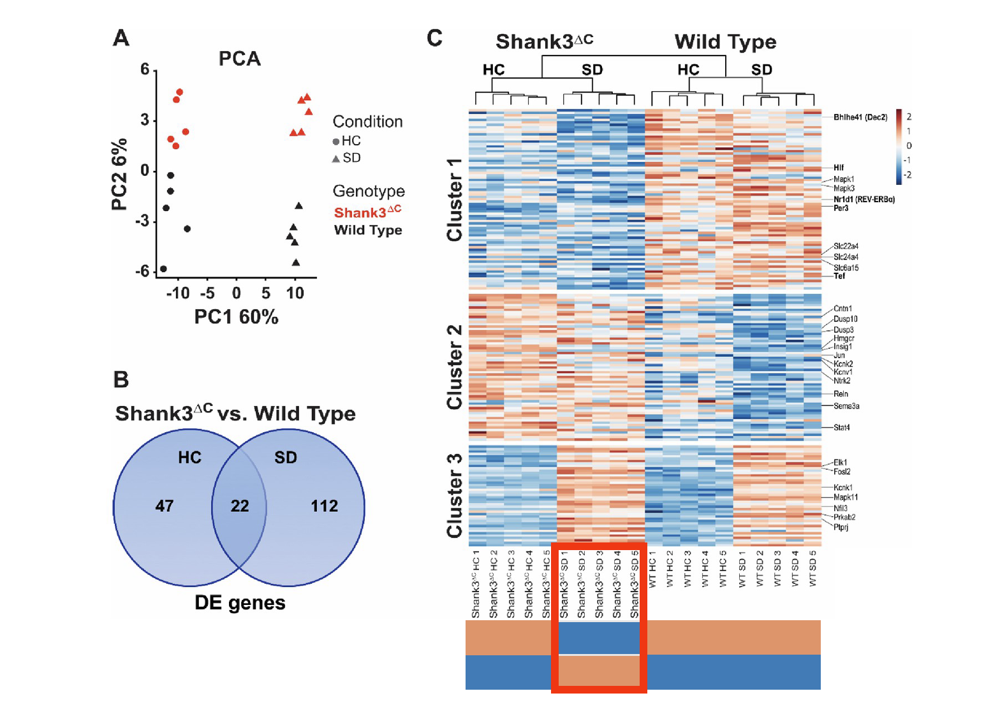
::::

:::: {.column width="42%"}
A simple \texttt{Genotype}-only design misses genes \textbf{specifically affected} in Shank3$^{\Delta C}$ / sleep-deprived mice.

\vspace{0.4em}

The Venn diagram shows 22 DE genes shared between conditions, but 112 unique to sleep deprivation.

::::

:::


# Data Preparation

## Workflow: Cleaning Data for DESeq2

\textbf{Download from GREIN}
\begin{enumerate}
  \item Navigate to \texttt{ilincs.org/apps/grein/}
  \item Enter GEO accession (e.g., GSE113754)
  \item Download \textbf{raw counts} \texttt{.csv}
  \item Download \textbf{metadata} \texttt{.csv}
\end{enumerate}

## Step 1: Downloading Data (GREIN)

::: {.columns}

:::: {.column width="50%"}
**GREIN** (GEO RNA-seq Experiments Interactive Navigator)

- Search by **GEO series accession** (e.g., GSE113754)
- Pre-aligned, gene-level raw counts ready to download
- Metadata table downloadable alongside counts
- Output: `.csv` files compatible with DESeq2

\vspace{0.3em}
\small\texttt{ilincs.org/apps/grein/}
::::

:::: {.column width="50%"}
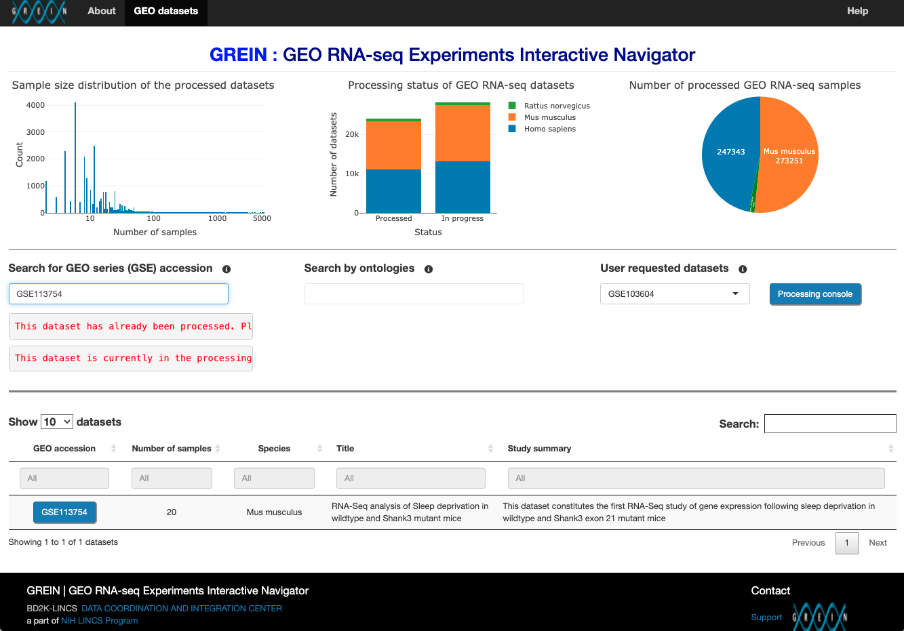
::::

:::

## Raw Counts: Downloading from GREIN

\begin{columns}
\begin{column}{0.63\textwidth}
\includegraphics[width=\linewidth]{assets/slide08_img03.png}
\end{column}
\begin{column}{0.35\textwidth}
The \textbf{Counts table} tab shows gene-level raw counts. Rows are genes (Ensembl ID + gene symbol); columns are samples.

\vspace{0.7em}
\small Select \textbf{Raw} data type, then click \textbf{Download data} to save as \texttt{.csv}.
\end{column}
\end{columns}

## Raw Counts: The CSV File

The downloaded file opens in Excel (or can be read directly into R).
The first column combines the Ensembl gene ID with the gene symbol.

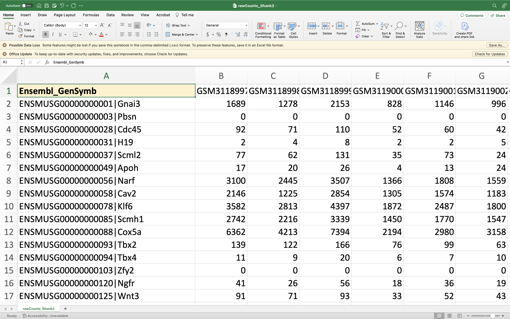

## Metadata: Downloading from GREIN

The **Metadata** tab lists sample-level characteristics.
Select **Filtered metadata** and check the variables you need before downloading.

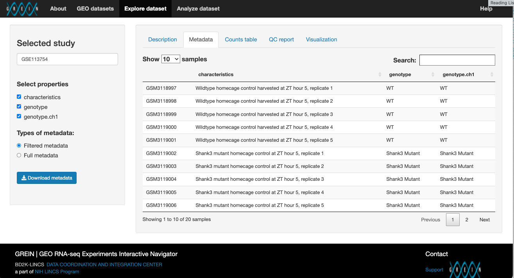

## Metadata: The CSV File

The metadata file records the experimental grouping for each sample.
The combined \texttt{Geno\_Cond} column captures all four groups.

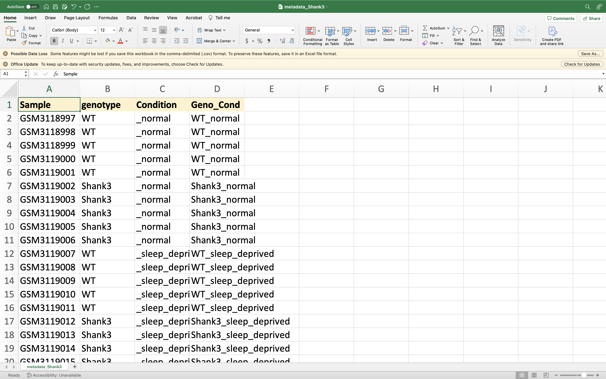

## DESeq2 Workflow Overview

::: {.columns}

:::: {.column width="60%"}

**Analysis steps in R / Positron:**

1. Import `.csv` files with `read.csv()`
2. Load the `DESeq2` package (install `BiocManager` first)
3. Assemble `DESeqDataSet` and specify `design`
4. Run `DESeq()` --- normalization + model fitting
5. Extract normalized counts and results table
6. Visualize: PCA, MA plot, `plotCounts()`

::::

:::: {.column width="40%"}

::::

:::

# R Walkthrough

## Getting Started in Positron

1. \href{https://github.com/YaleLibraryStatLab/differential-expression}{\texttt{github.com/YaleLibraryStatLab/differential-expression}}: **Code $\rightarrow$ Download ZIP**, then unzip
2. Positron: **File $\rightarrow$ Open Folder...** $\rightarrow$ select `differential-expression`
3. Open `scripts/DESeq2.R`
4. Check the working directory: `getwd()` should end in `differential-expression`

\vspace{0.3em}
\begingroup
\setbeamercolor{block title example}{fg=white, bg=statexample}
\setbeamercolor{block body example}{bg=statexbg, fg=statprimary}
\begin{exampleblock}{Best Practice: Use \texttt{here()} Instead of Hard Paths}
Hard-coded paths break when you move your project or share it. The \href{https://here.r-lib.org}{\texttt{here}} package builds paths relative to your project root automatically:
\vspace{0.2em}
\texttt{library(here)} \\
\texttt{read.csv(here("data", "raw", "rawCounts\_Shank3.csv"))}
\end{exampleblock}
\endgroup

## Importing Data in R

::: {.columns}

:::: {.column width="68%"}

```{r eval=FALSE, echo=TRUE}

library(here)

rawc <- read.csv(
  here("data", "raw", "rawCounts_Shank3.csv"),
  header = T, row.names = "Ensembl_GenSymb")

info <- read.csv(
  here("data", "raw", "metadata_Shank3.csv"),
  header = T, stringsAsFactors = T)

# Specify the baseline for comparisons
info$genotype  <- relevel(info$genotype,  "WT")
info$Condition <- relevel(info$Condition, "_normal")
```

::::

:::: {.column width="32%"}

```{=latex}
{\small
\begin{block}{Note}
\texttt{here()} paths start at the workshop folder you opened in Positron.
\end{block}

\vspace{0.4em}

\begin{block}{Why \texttt{relevel()}?}
DESeq2 uses the \textbf{first factor level} as the reference for fold-change calculations --- ensures the control group is the baseline.
\end{block}
}
```

::::

:::

## Assembling the DESeqDataSet

```{r eval=FALSE, echo=TRUE}
if (!require("BiocManager", quietly = TRUE))
    install.packages("BiocManager")
BiocManager::install("DESeq2")
library(DESeq2)

## Assemble DESeqDataSet
Shank3 <- DESeqDataSetFromMatrix(
    countData = rawc,
    colData   = info,
    design    = ~ 
)
```

##

The formula specifies which metadata column(s) model the variation in gene counts.
Choosing the right design is the most consequential decision in the analysis.

## Metadata and the Model Matrix

\begin{columns}
\begin{column}{0.63\textwidth}
\includegraphics[width=\linewidth]{assets/slide07_img03.png}
\end{column}
\begin{column}{0.35\textwidth}
The key to all designs is how we \textbf{organize the metadata} and \textbf{design the model matrix}.

\vspace{0.7em}
\small The formula \texttt{\textasciitilde{} (baseline) + Condition} tells DESeq2 how to model counts per gene. \textit{(Credit: Hugo Tavares)}
\end{column}
\end{columns}


# Design Matrices \& Linear Models

## What is a Design Matrix?

The *design matrix* $X$ translates your experimental design into a form the model can use

- **Rows** = samples (observations)

- **Columns** = model parameters (intercept, group effects, batch effects, \ldots)


```{=latex}
\begin{definitionblock}[Design Matrix]
``The design matrix is the mathematical encoding of your experimental design.
The choice of formula is not a software concern -- it determines what
questions your analysis can answer.'' --- adapted from Law et al.\ (2020)
\end{definitionblock}
```

## What is a Linear Model?

$$y = X\beta + \varepsilon$$

- $y$ --- response vector (observed counts for one gene, across samples)
- $X$ --- design matrix encoding the experimental structure
- $\beta$ --- parameter vector (effects we want to estimate)
- $\varepsilon$ --- residual / noise term

This framework generalizes: we fit one model per gene, then correct for multiple testing across all \textasciitilde 20,000 tests.


```{r echo=TRUE, eval=FALSE}
model.matrix(~ condition, data = sample_info)
```

## The Three Basic Model Types

```{r echo=FALSE, eval=TRUE, fig.height=4, fig.width=10}
par(mfrow = c(1, 3), mar = c(4, 4, 2.5, 1), cex.main = 1.1)
set.seed(42)
age <- c(2, 4, 6, 8, 10)
expr_reg <- 1.85 + 0.54 * age + rnorm(5, 0, 0.3)
plot(age, expr_reg, pch = 19, col = "steelblue", cex = 1.5,
     xlab = "Age", ylab = "Expression", main = "Regression Model",
     ylim = c(0, 8), xlim = c(0, 12))
abline(lm(expr_reg ~ age), col = "firebrick", lwd = 2)
set.seed(42)
healthy <- rnorm(4, 2.95, 0.4); sick <- rnorm(4, 4.57, 0.4)
plot(c(rep(1,4), rep(2,4)), c(healthy, sick), pch = 19,
     col = rep(c("steelblue","coral"), each=4), cex = 1.5,
     xlab = "", ylab = "Expression", main = "Means Model",
     xlim = c(0.5,2.5), xaxt = "n", ylim = c(1.5,6))
axis(1, at = 1:2, labels = c("Healthy","Sick"))
segments(0.7, mean(healthy), 1.3, mean(healthy), col = "steelblue", lwd = 2)
segments(1.7, mean(sick),    2.3, mean(sick),    col = "coral",     lwd = 2)
text(1, mean(healthy)+0.3, expression(mu[H]), cex=1.2)
text(2, mean(sick)+0.3,    expression(mu[S]), cex=1.2)
plot(c(rep(1,4), rep(2,4)), c(healthy, sick), pch = 19,
     col = rep(c("steelblue","coral"), each=4), cex = 1.5,
     xlab = "", ylab = "Expression", main = "Mean-Reference Model",
     xlim = c(0.5,2.5), xaxt = "n", ylim = c(1.5,6))
axis(1, at = 1:2, labels = c("Healthy","Sick"))
abline(h = mean(healthy), col = "steelblue", lwd = 2, lty = 2)
arrows(2, mean(healthy), 2, mean(sick), col = "firebrick", lwd=2, length=0.1, code=3)
text(2.3, (mean(healthy)+mean(sick))/2, expression(beta[1]), cex=1.2, col="firebrick")
text(0.7, mean(healthy)+0.3,            expression(beta[0]), cex=1.2, col="steelblue")
```

Three fundamental model types (Law et al.\ 2020): regression, means, and mean-reference.

## Reading \texttt{model.matrix()} Output

```{r echo=TRUE, eval=FALSE}
model.matrix(~ condition, data = sample_info)
```

```{=latex}
\bigskip\centering
\begin{tabular}{lcc}
\hline
 & \texttt{(Intercept)} & \texttt{conditiontreated} \\
\hline
ctrl\_1 & 1 & 0 \\ ctrl\_2 & 1 & 0 \\ ctrl\_3 & 1 & 0 \\
trt\_1  & 1 & 1 \\ trt\_2  & 1 & 1 \\ trt\_3  & 1 & 1 \\
\hline
\end{tabular}
```

- Intercept = mean of the **reference** level (control)
- `conditiontreated` = difference: treated $-$ control

## Means vs.\ Mean-Reference: Two Parameterizations

:::: {.columns}
::: {.column width="48%"}
**Means model** (`~ 0 + condition`)

- $\beta_1 = \mu_{\text{ctrl}}$, $\beta_2 = \mu_{\text{trt}}$
- Test: $\beta_2 - \beta_1 = 0$
- Direct group means; contrasts required
:::
::: {.column width="48%"}
**Mean-reference model** (`~ condition`)

- $\beta_0 = \mu_{\text{ctrl}}$
- $\beta_1 = \mu_{\text{trt}} - \mu_{\text{ctrl}}$
- Test: $\beta_1 = 0$ --- R's default
:::
::::

\bigskip

Both are **mathematically equivalent** --- identical fitted values and residuals.

## Setting the Reference Level

```{r echo=TRUE, eval=FALSE}
# Set reference level at creation
sample_info$condition <- factor(sample_info$condition,
                                levels = c("control", "treated"))
# Or relevel an existing factor
sample_info$condition <- relevel(sample_info$condition,
                                 ref = "control")
```

```{=latex}
\begin{alertblock}{Warning}
R uses \textbf{alphabetical order} by default. Always set the reference
level explicitly so your log fold changes have the direction you expect.
\end{alertblock}
```

## Treatments vs.\ Control

4-group scenario: CTL, Treatment I, II, III --- use `relevel()` to set CTL as reference.

```{r echo=TRUE, eval=FALSE}
sample_info$treatment <- relevel(sample_info$treatment, ref = "CTL")
model.matrix(~ treatment, data = sample_info)
```

```{=latex}
\bigskip\centering\footnotesize
\begin{tabular}{lcccc}
\hline
 & \texttt{(Intercept)} & \texttt{treatmentI} & \texttt{treatmentII} & \texttt{treatmentIII} \\
\hline
CTL\_1    & 1 & 0 & 0 & 0 \\
TrtI\_1   & 1 & 1 & 0 & 0 \\
TrtII\_1  & 1 & 0 & 1 & 0 \\
TrtIII\_1 & 1 & 0 & 0 & 1 \\
\hline
\end{tabular}
```

Each treatment column gives the treatment-vs-control difference directly.

## All Pairwise Comparisons: Means Model

Same 4 groups with `~ 0 + treatment` --- each column estimates a group mean.

```{=latex}
\centering\footnotesize
\begin{tabular}{lcccc}
\hline
 & \texttt{treatCTL} & \texttt{treatI} & \texttt{treatII} & \texttt{treatIII} \\
\hline
CTL\_1    & 1 & 0 & 0 & 0 \\
TrtI\_1   & 0 & 1 & 0 & 0 \\
TrtII\_1  & 0 & 0 & 1 & 0 \\
TrtIII\_1 & 0 & 0 & 0 & 1 \\
\hline
\end{tabular}
```

\vspace{0.4em}

Any pairwise comparison is then a contrast: e.g., Treatment I vs II: `contrast = c("treatment", "I", "II")`

## Contrasts

```{=latex}
\begin{definitionblock}[Contrast]
A contrast is a linear combination of model parameters specified by a weight vector.
\end{definitionblock}
```

Examples (means model `~ 0 + treatment`):

- Treatment I vs.\ Control: weights $(-1,\ 1,\ 0,\ 0)$
- Average of all treatments vs.\ Control: weights $(-1,\ \tfrac{1}{3},\ \tfrac{1}{3},\ \tfrac{1}{3})$
- Groups I+II vs.\ III+CTL: weights $(-\tfrac{1}{2},\ \tfrac{1}{2},\ \tfrac{1}{2},\ -\tfrac{1}{2})$

```{r echo=TRUE, eval=FALSE}
results(dds, contrast = c(-1, 1/3, 1/3, 1/3))
```

## Interaction Designs

```{r echo=TRUE, eval=FALSE}
# ~ genotype * treatment expands to:
# ~ genotype + treatment + genotype:treatment
model.matrix(~ genotype * treatment, data = sample_info)
```

```{=latex}
\bigskip\centering\footnotesize
\begin{tabular}{lcccc}
\hline
 & \texttt{(Int.)} & \texttt{genoMut} & \texttt{trtStim} & \texttt{genoMut:trtStim} \\
\hline
WT\_ctrl   & 1 & 0 & 0 & 0 \\ WT\_stim   & 1 & 0 & 1 & 0 \\
Mut\_ctrl  & 1 & 1 & 0 & 0 \\ Mut\_stim  & 1 & 1 & 1 & 1 \\
\hline
\end{tabular}
```

The interaction column equals 1 **only** when both non-reference levels are present.

## Interaction as Synergy or Additivity

$$\delta = C - A - B$$

where $A$ = effect of treatment 1, $B$ = effect of treatment 2, $C$ = combined effect.

- $\delta > 0$: **synergistic** --- combined exceeds sum of parts
- $\delta = 0$: **additive** --- no interaction
- $\delta < 0$: **antagonistic** --- combined less than sum of parts

The interaction coefficient in `~ treat1 * treat2` directly estimates $\delta$.

```{=latex}
\begin{alertblock}{Reference-Level Dependency}
The interaction coefficient $\delta$ is defined \textbf{relative to the
reference levels} of both factors. Changing the reference level of either
factor changes the value of $\delta$. Always report which levels are being
compared when interpreting an interaction term.
\end{alertblock}
```

## The Group Variable Shortcut

```{=latex}
\begin{alertblock}{Replication Required}
Interaction terms require adequate replication in \textbf{all}
factor-level combinations. With unbalanced designs, the group
variable approach is often simpler.
\end{alertblock}
```

Merge factors into a single group variable --- all pairwise contrasts become direct.

```{r echo=TRUE, eval=FALSE}
dds$group <- factor(paste0(dds$tissue, "_", dds$celltype))
design(dds) <- ~ 0 + group
```

```{=latex}
\centering\footnotesize
\begin{tabular}{lcccc}
\hline
 & \texttt{groupLUNG\_B} & \texttt{groupBRAIN\_B} & \texttt{groupLUNG\_T} & \texttt{groupBRAIN\_T} \\
\hline
LUNG\_B\_1  & 1 & 0 & 0 & 0 \\
BRAIN\_B\_1 & 0 & 1 & 0 & 0 \\
LUNG\_T\_1  & 0 & 0 & 1 & 0 \\
BRAIN\_T\_1 & 0 & 0 & 0 & 1 \\
\hline
\end{tabular}
```

B vs T within lung: `contrast = c("group", "LUNG_B", "LUNG_T")`. Recommended by Law et al.\ (2020) and the DESeq2 vignette.

## Paired and Repeated Measures

Scenario: 6 mice (3 per treatment), each measured at two time points.

`~ treatment + time` may fail when mice are **nested** within treatment. Instead, model individual baselines with a numeric design matrix:

```{r echo=TRUE, eval=FALSE}
mm <- model.matrix(~ 0 + mouse + treatment_time,
                   data = sample_info)
design(dds) <- mm
dds <- DESeq(dds)
```

## Multi-Factor Designs

```{r echo=TRUE, eval=FALSE}
model.matrix(~ batch + condition, data = sample_info)
```

```{=latex}
\bigskip\centering
\begin{tabular}{lccc}
\hline
 & \texttt{(Intercept)} & \texttt{batchB} & \texttt{conditiontreated} \\
\hline
A\_ctrl\_1 & 1 & 0 & 0 \\ A\_ctrl\_2 & 1 & 0 & 0 \\
A\_trt\_1  & 1 & 0 & 1 \\ B\_ctrl\_1 & 1 & 1 & 0 \\
B\_trt\_1  & 1 & 1 & 1 \\ B\_trt\_2  & 1 & 1 & 1 \\
\hline
\end{tabular}
```

The condition effect is estimated **after removing** batch differences.

## The Design Matrix Absorbs Nuisance Variation

- Adding `batch` partitions variance into batch + condition + residual
- The condition coefficient is estimated **conditional on** batch
- **Without batch:** estimate contaminated by batch-to-batch variation
- **With batch:** "cleaned" estimate --- only within-batch treatment difference

```{=latex}
\begin{exampleblock}{Rule of Thumb}
Include a variable in the design if PCA shows it drives a principal
component. The design matrix will absorb that variation (Law et al.\ 2020).
\end{exampleblock}
```

## Where the Linear Model Breaks Down

The standard linear model $y = X\beta + \varepsilon$ assumes conditions that count data routinely violates:

- **Normal errors** --- counts are non-negative integers; residuals for low-count genes are right-skewed, not normal
- **Constant variance** --- variance in RNA-seq grows with the mean; high-abundance genes show far more raw spread
- **Unbounded predictions** --- the linear predictor $X\beta$ can return negative fitted counts

## From Linear Models to GLMs

Generalized linear models add a **link function** $g$:

$$g(\mu) = X\beta \qquad \Longrightarrow \qquad \log(\mu) = X\beta$$

- For count data we use the **log link**: $\mu = e^{X\beta}$
- Effects are **multiplicative** on the original scale
- DESeq2 coefficients are on the **natural log scale** internally


## Why Negative Binomial?

```{=latex}
\begin{definitionblock}[Negative Binomial Distribution]
$K_{ij} \sim \text{NB}(\mu_{ij},\, \alpha_i)$, where $\mu_{ij}$ is the
mean count for gene $i$ in sample $j$, and $\alpha_i$ is the
gene-specific \textbf{dispersion} parameter.
\end{definitionblock}
```

- **Poisson** assumes $\text{Var} = \mu$ --- too restrictive for biological data
- Real RNA-seq counts exhibit **overdispersion**: variance $>$ mean
- The NB adds dispersion $\alpha$ capturing extra biological variability

$$\text{Var}(K_{ij}) = \mu_{ij} + \alpha_i \cdot \mu_{ij}^2$$

## Variance Grows with the Mean

```{r echo=FALSE, fig.height=3.0, fig.width=7.5, out.width="0.78\\linewidth", fig.align="center"}
suppressPackageStartupMessages(library(DESeq2))
nc         <- counts(dds_airway, normalized = TRUE)
gm         <- rowMeans(nc)
gv         <- apply(nc, 1, var)
par(mar = c(4.2, 4.2, 0.4, 0.5))
plot(gm, gv, log = "xy", pch = 19, cex = 0.3,
     col = adjustcolor("#2980b9", 0.35),
     xlab = "Mean normalized count", ylab = "Variance",
     cex.lab = 1.0, cex.axis = 0.85)
abline(0, 1, col = "#e74c3c", lwd = 2, lty = 2)
legend("topleft", legend = "Var = Mean (Poisson)",
       col = "#e74c3c", lty = 2, lwd = 2, bty = "n", cex = 0.85)
```

Each point is a gene. Observed variance exceeds the Poisson expectation at every expression level.

## Coefficients: Internal Scale vs. Reported Output

DESeq2 fits the model on the natural log scale, but reports results on $\log_2$:

$$\log_2\text{FC} = \frac{\beta}{\log(2)}$$

A raw coefficient $\beta_1 = 0.5$ becomes $0.5 / 0.693 \approx 0.72$ in the output --- a $2^{0.72} \approx 1.65$-fold change.

Always back-calculate from \texttt{log2FoldChange} in the results table, not from the raw GLM coefficient.


## Checking Your Design

```{r echo=TRUE, eval=FALSE}
mm <- model.matrix(~ batch + condition, data = sample_info)
qr(mm)$rank   # should equal ncol(mm)
ncol(mm)       # number of parameters
```

```{=latex}
\begin{alertblock}{Rank Deficiency}
If \texttt{rank < ncol}, columns are linearly dependent ---
some factor is \textbf{perfectly confounded} with another.
This is a \textbf{design problem}, not a software problem.
DESeq2 will refuse to run, and rightly so.
\end{alertblock}
```

# Design Challenge

## Exercise 1: Choose the Right Formula

::: {.columns}

:::: {.column width="52%"}

**Experiment:** 6 samples, one factor

```{=latex}
\centering\small
\begin{tabular}{ll}
\hline
\textbf{Sample} & \textbf{Condition} \\
\hline
ctrl\_1 & control \\ ctrl\_2 & control \\ ctrl\_3 & control \\
trt\_1  & treated \\ trt\_2  & treated \\ trt\_3  & treated \\
\hline
\end{tabular}
```

\vspace{0.6em}
\textbf{Goal:} compare treated vs.\ control

::::

:::: {.column width="48%"}

```{=latex}
\begin{block}{Which design formula?}
\begin{itemize}
  \item[\textbf{A.}] \texttt{\textasciitilde{} 0 + condition}
  \item[\textbf{B.}] \texttt{\textasciitilde{} condition}
  \item[\textbf{C.}] \texttt{\textasciitilde{} condition + sample}
  \item[\textbf{D.}] \texttt{\textasciitilde{} 1}
\end{itemize}
\end{block}
```

::::

:::

## Exercise 1: Answer

::: {.columns}

:::: {.column width="52%"}

```{=latex}
\centering\small
\begin{tabular}{ll}
\hline
\textbf{Sample} & \textbf{Condition} \\
\hline
ctrl\_1 & control \\ ctrl\_2 & control \\ ctrl\_3 & control \\
trt\_1  & treated \\ trt\_2  & treated \\ trt\_3  & treated \\
\hline
\end{tabular}
```

::::

:::: {.column width="48%"}

```{=latex}
{\small
\textcolor{gray}{A. \texttt{\textasciitilde{} 0 + condition} --- means model, valid but needs explicit contrast}

\vspace{0.5em}

\begin{block}{B. \texttt{\textasciitilde{} condition}}
Mean-reference model: intercept = control mean;
\texttt{conditiontreated} = fold change directly.
R's default parameterization.
\end{block}

\vspace{0.3em}

\textcolor{gray}{C. Over-specified --- sample absorbs all variance}

\vspace{0.2em}

\textcolor{gray}{D. Intercept only --- no group comparison possible}
}
```

::::

:::

## Exercise 2: Choose the Right Formula

::: {.columns}

:::: {.column width="52%"}

**Experiment:** 2 batches, treated vs.\ control in each

```{=latex}
\centering\small
\begin{tabular}{lll}
\hline
\textbf{Sample} & \textbf{Batch} & \textbf{Condition} \\
\hline
A\_ctrl\_1 & A & control \\ A\_ctrl\_2 & A & control \\
A\_trt\_1  & A & treated \\ B\_ctrl\_1 & B & control \\
B\_trt\_1  & B & treated \\ B\_trt\_2  & B & treated \\
\hline
\end{tabular}
```

\vspace{0.6em}
\textbf{Goal:} treatment effect adjusted for batch

::::

:::: {.column width="48%"}

```{=latex}
\begin{block}{Which design formula?}
\begin{itemize}
  \item[\textbf{A.}] \texttt{\textasciitilde{} condition}
  \item[\textbf{B.}] \texttt{\textasciitilde{} batch}
  \item[\textbf{C.}] \texttt{\textasciitilde{} batch + condition}
  \item[\textbf{D.}] \texttt{\textasciitilde{} batch * condition}
\end{itemize}
\end{block}
```

::::

:::

## Exercise 2: Answer

::: {.columns}

:::: {.column width="52%"}

```{=latex}
\centering\small
\begin{tabular}{lll}
\hline
\textbf{Sample} & \textbf{Batch} & \textbf{Condition} \\
\hline
A\_ctrl\_1 & A & control \\ A\_ctrl\_2 & A & control \\
A\_trt\_1  & A & treated \\ B\_ctrl\_1 & B & control \\
B\_trt\_1  & B & treated \\ B\_trt\_2  & B & treated \\
\hline
\end{tabular}
```

::::

:::: {.column width="48%"}

```{=latex}
{\small
\textcolor{gray}{A. Ignores batch --- condition estimate contaminated}

\vspace{0.3em}

\textcolor{gray}{B. Models batch only --- not the goal}

\vspace{0.3em}

\begin{block}{C. \texttt{\textasciitilde{} batch + condition}}
Batch absorbs technical variation; \texttt{conditiontreated}
estimates the treatment effect within each batch.
\end{block}

\vspace{0.3em}

\textcolor{gray}{D. Tests whether treatment effect \emph{differs} by batch --- not needed here}
}
```

::::

:::

## Exercise 3: Choose the Right Formula

::: {.columns}

:::: {.column width="52%"}

**Experiment:** one control + three treatments

```{=latex}
\centering\small
\begin{tabular}{ll}
\hline
\textbf{Sample} & \textbf{Treatment} \\
\hline
CTL\_1 & CTL \\ CTL\_2 & CTL \\
TrtA\_1 & TreatmentA \\ TrtA\_2 & TreatmentA \\
TrtB\_1 & TreatmentB \\ TrtB\_2 & TreatmentB \\
\hline
\end{tabular}
```

\vspace{0.6em}
\textbf{Goal:} each treatment vs.\ CTL as the reference

::::

:::: {.column width="48%"}

```{=latex}
\begin{block}{Which design formula?}
\begin{itemize}
  \item[\textbf{A.}] \texttt{\textasciitilde{} 0 + treatment}
  \item[\textbf{B.}] \texttt{\textasciitilde{} treatment}\\
        \small(after \texttt{relevel(ref = "CTL")})
  \item[\textbf{C.}] \texttt{\textasciitilde{} treatment - 1}
  \item[\textbf{D.}] \texttt{\textasciitilde{} treatment + sample}
\end{itemize}
\end{block}
```

::::

:::

## Exercise 3: Answer

::: {.columns}

:::: {.column width="52%"}

```{=latex}
\centering\small
\begin{tabular}{ll}
\hline
\textbf{Sample} & \textbf{Treatment} \\
\hline
CTL\_1  & CTL \\ CTL\_2  & CTL \\
TrtA\_1 & TreatmentA \\ TrtA\_2 & TreatmentA \\
TrtB\_1 & TreatmentB \\ TrtB\_2 & TreatmentB \\
\hline
\end{tabular}
```

::::

:::: {.column width="48%"}

```{=latex}
{\small
\textcolor{gray}{A. Means model --- valid, but requires explicit contrasts for each vs.\ CTL}

\vspace{0.3em}

\begin{block}{B. \texttt{\textasciitilde{} treatment}}
After \texttt{relevel(ref = "CTL")}, each coefficient is
TreatmentX $-$ CTL directly. No explicit contrasts needed.
\end{block}

\vspace{0.3em}

\textcolor{gray}{C. Equivalent to A --- removes the intercept}

\vspace{0.2em}

\textcolor{gray}{D. Overfit --- sample is nested within treatment; model matrix is rank-deficient}
}
```

::::

:::

## Exercise 4: Choose the Right Formula

::: {.columns}

:::: {.column width="52%"}

**Experiment:** 2 genotypes $\times$ 2 treatments (2 $\times$ 2 factorial)

```{=latex}
\centering\small
\begin{tabular}{lll}
\hline
\textbf{Sample} & \textbf{Genotype} & \textbf{Treatment} \\
\hline
WT\_ctrl  & WT     & Control \\
WT\_drug  & WT     & Drug    \\
Mut\_ctrl & Mutant & Control \\
Mut\_drug & Mutant & Drug    \\
\hline
\end{tabular}
```

\vspace{0.5em}
\textbf{Goal:} detect genes where the drug effect \emph{differs} between genotypes

::::

:::: {.column width="48%"}

```{=latex}
\begin{block}{Which design formula?}
\begin{itemize}
  \item[\textbf{A.}] \texttt{\textasciitilde{} genotype + treatment}
  \item[\textbf{B.}] \texttt{\textasciitilde{} genotype}
  \item[\textbf{C.}] \texttt{\textasciitilde{} genotype * treatment}
  \item[\textbf{D.}] \texttt{\textasciitilde{} treatment}
\end{itemize}
\end{block}
```

::::

:::

## Exercise 4: Answer

::: {.columns}

:::: {.column width="52%"}

```{=latex}
\centering\small
\begin{tabular}{lll}
\hline
\textbf{Sample} & \textbf{Genotype} & \textbf{Treatment} \\
\hline
WT\_ctrl  & WT     & Control \\
WT\_drug  & WT     & Drug    \\
Mut\_ctrl & Mutant & Control \\
Mut\_drug & Mutant & Drug    \\
\hline
\end{tabular}
```

::::

:::: {.column width="48%"}

```{=latex}
{\small
\textcolor{gray}{A. Additive only --- assumes drug effect is the same in both genotypes}

\vspace{0.3em}

\textcolor{gray}{B. Genotype main effect only --- ignores treatment entirely}

\vspace{0.3em}

\begin{block}{C. \texttt{\textasciitilde{} genotype * treatment}}
Expands to \texttt{\textasciitilde{} genotype + treatment +}\\
\texttt{genotype:treatment}. The interaction term tests
whether the drug effect \emph{differs by genotype}.
\end{block}

\vspace{0.3em}

\textcolor{gray}{D. Treatment main effect only --- ignores genotype}
}
```

::::

:::

## Exercise 5: The Shank3 Study

::: {.columns}

:::: {.column width="52%"}

**Our case study:** 2 genotypes $\times$ 2 conditions, $n = 5$ per group

```{=latex}
\centering\small
\begin{tabular}{lll}
\hline
\textbf{Genotype} & \textbf{Condition} & $n$ \\
\hline
Shank3$^{\Delta C}$ & Normal           & 5 \\
Shank3$^{\Delta C}$ & Sleep\_deprived  & 5 \\
Wild Type           & Normal           & 5 \\
Wild Type           & Sleep\_deprived  & 5 \\
\hline
\end{tabular}
```

\vspace{0.5em}
\textbf{Goal:} find genes specifically altered in Shank3 mice under sleep deprivation

::::

:::: {.column width="48%"}

```{=latex}
\begin{block}{Which design formula?}
\begin{itemize}
  \item[\textbf{A.}] \texttt{\textasciitilde{} genotype}
  \item[\textbf{B.}] \texttt{\textasciitilde{} Condition}
  \item[\textbf{C.}] \texttt{\textasciitilde{} genotype + Condition}
  \item[\textbf{D.}] \texttt{\textasciitilde{} genotype + Condition}\\
        \texttt{+ genotype:Condition}
\end{itemize}
\end{block}
```

::::

:::

## Case Study: Complete DESeq2 Setup

::: {.columns}

:::: {.column width="58%"}
**Our case study:** 2 genotypes $\times$ 2 conditions, $n = 5$ per group

```{=latex}
\centering\small
\begin{tabular}{lll}
\hline
\textbf{Genotype} & \textbf{Condition} & $n$ \\
\hline
Shank3$^{\Delta C}$ & Normal           & 5 \\
Shank3$^{\Delta C}$ & Sleep\_deprived  & 5 \\
Wild Type           & Normal           & 5 \\
Wild Type           & Sleep\_deprived  & 5 \\
\hline
\end{tabular}
```

::::

:::: {.column width="42%"}

```{=latex}
{\small
\textcolor{gray}{A. \texttt{\textasciitilde{} genotype} --- misses the condition effect}

\vspace{0.3em}

\textcolor{gray}{B. \texttt{\textasciitilde{} Condition} --- misses the genotype effect}

\vspace{0.3em}

\textcolor{gray}{C. Additive only --- assumes genotype and condition effects are independent}

\vspace{0.3em}

\begin{block}{D. \texttt{\textasciitilde{} genotype + Condition + genotype:Condition}}
The interaction term captures genes whose
response to sleep deprivation \emph{differs}
between Shank3 and WT mice.
\end{block}
}
```

::::

:::

## Case Study: Complete DESeq2 Setup in R

```{r eval=FALSE, echo=TRUE, size="tiny"}
## Assemble DESeqDataSet
Shank3 <- DESeqDataSetFromMatrix(
    countData = rawc,
    colData   = info,
    design    = ~ genotype + Condition +
                  genotype:Condition
)

```

# Running DESeq2: Shank3 Case Study

## Exploratory Analysis: \texttt{rlog} and \texttt{plotPCA()}

```{r eval=FALSE, echo=TRUE}
log_DEX_Shank3 <- rlog(DEX_Shank3)
plotPCA(log_DEX_Shank3, intgroup = "Geno_Cond")
```

::: {.columns}

:::: {.column width="50%"}
- `rlog()` applies a regularized log transformation, stabilizing variance across genes
- Use `intgroup` to colour samples by an experimental group
- The `plotPCA()` function from DESeq2 returns a `ggplot2` object --- customizable
::::

:::: {.column width="50%"}

::::

:::

## PCA Interpretation

::: {.columns}

:::: {.column width="58%"}
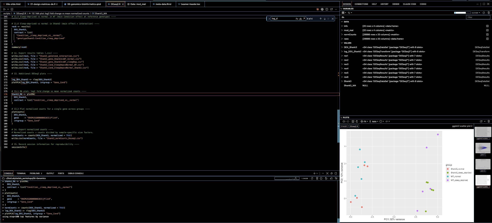
::::

:::: {.column width="42%"}

```{=latex}
\begin{block}{Key Observation}
The dominant source of variation (PC1: 32\%) is \textbf{housing condition}
--- WT and Shank3 samples are \emph{mixed} within the normal and
sleep-deprived clouds.
\end{block}
```

\vspace{0.5em}

This means **condition** should come first in the design formula, ahead of genotype.

::::

:::

## Re-designing Based on the PCA

PCA shows condition drives more variance than genotype --- place it first in the formula so DESeq2 reports its coefficient first via `resultsNames()`.

```{r eval=FALSE, echo=TRUE}
Shank3 <- DESeqDataSetFromMatrix(
    countData = rawc,
    colData   = info,
    design    = ~ Condition + genotype +
                  Condition:genotype
)
```

The \textbf{last} term in the formula is the default coefficient returned by \texttt{results()}. Placing the interaction last keeps it as the default output --- the comparison of greatest interest.

## Understanding the Model Matrix

Use `model.matrix()` to inspect exactly what DESeq2 is fitting.

```{r eval=FALSE, echo=TRUE}
mod_mat <- model.matrix(design(DEX_Shank3),
                         colData(DEX_Shank3))
```

::: {.columns}

:::: {.column width="55%"}
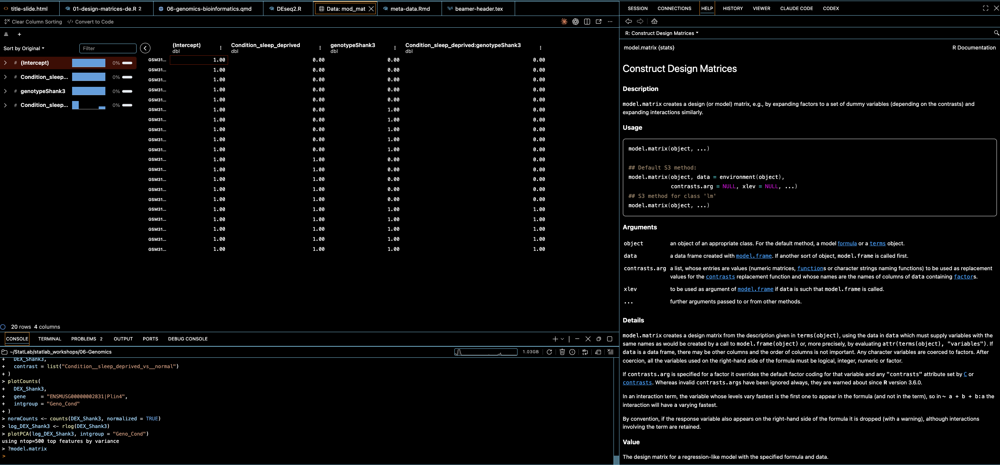
::::

:::: {.column width="45%"}

Four columns confirm the design:

- `(Intercept)` = WT, Normal baseline
- `Condition_sleep_deprived`
- `genotypeShank3`
- `Condition_sleep_deprived:genotypeShank3`

::::

:::

## Extracting Results: \texttt{resultsNames()}

```{r eval=FALSE, echo=TRUE}
resultsNames(DEX_Shank3)
# [1] "Intercept"
# [2] "Condition__sleep_deprived_vs__normal"
# [3] "genotype_Shank3_vs_WT"
# [4] "genotypeShank3.Condition_sleep_deprived"
```

```{=latex}
\begin{block}{Four Estimable Comparisons}
\begin{enumerate}
  \item Condition: sleep-deprived vs.\ normal \textit{(in WT)}
  \item Genotype: Shank3 vs.\ WT \textit{(in normal conditions)}
  \item Interaction: does the Condition effect differ in Shank3?
\end{enumerate}
\end{block}
```

\vspace{0.3em}
\small The default `results(DEX_Shank3)` returns the \textbf{last} coefficient --- the interaction term.

## Comparison 1 \& 2: Genotype Effect

::: {.columns}

:::: {.column width="55%"}
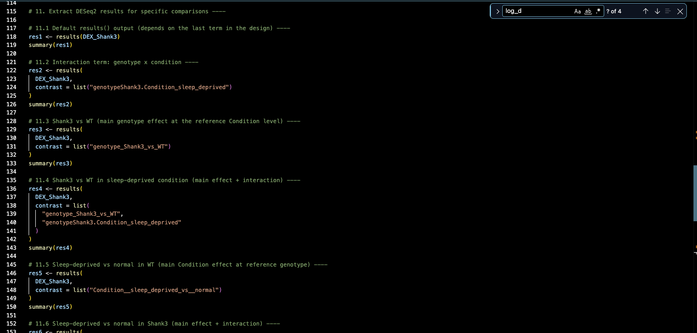
::::

:::: {.column width="45%"}

**Shank3 vs WT in \emph{normal} conditions:**

```{r eval=FALSE, echo=TRUE}
res3 <- results(DEX_Shank3,
  contrast = list(
    "genotype_Shank3_vs_WT"))
```

\vspace{0.5em}

**Shank3 vs WT in \emph{sleep-deprived} conditions** (add interaction):

```{r eval=FALSE, echo=TRUE}
res4 <- results(DEX_Shank3,
  contrast = list(
    "genotype_Shank3_vs_WT",
    "genotypeShank3.Condition_sleep_deprived"
  ))
```

::::

:::

## Comparison 3 \& 4: Condition Effect

**Sleep-deprived vs normal in \emph{WT} mice:**

```{r eval=FALSE, echo=TRUE}
res5 <- results(DEX_Shank3,
  contrast = list("Condition__sleep_deprived_vs__normal"))
```

\vspace{0.5em}

**Sleep-deprived vs normal in \emph{Shank3} mice** (add interaction):

```{r eval=FALSE, echo=TRUE}
res6 <- results(DEX_Shank3,
  contrast = list(
    "Condition__sleep_deprived_vs__normal",
    "genotypeShank3.Condition_sleep_deprived"
  ))
```

```{=latex}
\begin{block}{The Interaction Pattern}
Combining a main-effect coefficient with the interaction coefficient
"shifts" the comparison from the reference genotype to the other.
See: \small\texttt{bioconductor.org} DESeq2 vignette \textsection Interactions.
\end{block}
```

## Interpreting \texttt{summary()} Output

::: {.columns}

:::: {.column width="58%"}
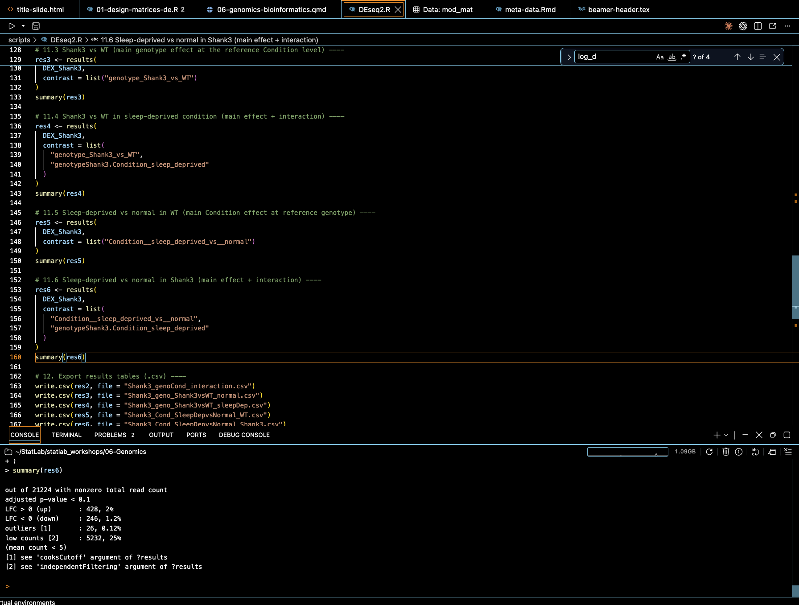
::::

:::: {.column width="42%"}

- **lfc > 0 (up):** 426 genes, 2.3%
- **lfc < 0 (down):** 244 genes, 1.3%
- **low counts:** 2,527 genes filtered (12%)

```{=latex}
\begin{alertblock}{Fold Change Threshold}
The default uses $|\log_2\text{FC}| > 0$.
Note: $\log_2\text{FC} = 1.5$ (a common biological threshold) equals only \textbf{0.58} on the $\log_2$ scale.
\end{alertblock}
```

::::

:::

## Exporting Results with \texttt{write.csv()}

Once you have a results object, export it to the `results/` folder:

```{r eval=FALSE, echo=TRUE}
# Export the interaction results
write.csv(res2, here("results", "Shank3_genoCond_interaction.csv"))

# Export other comparisons
write.csv(res3, here("results", "Shank3_geno_Shank3vsWT_normal.csv"))
write.csv(res4, here("results", "Shank3_geno_Shank3vsWT_sleepDep.csv"))
write.csv(res5, here("results", "Shank3_Cond_SleepDepvsNormal_WT.csv"))
write.csv(res6, here("results", "Shank3_Cond_SleepDepvsNormal_Shank3.csv"))
```

Specify the object to export (e.g., \texttt{res2}) and the filename. The script creates \texttt{results/} with \texttt{dir.create(here("results"))} before the first export.

## MA Plot: \texttt{plotMA()}

::: {.columns}

:::: {.column width="55%"}
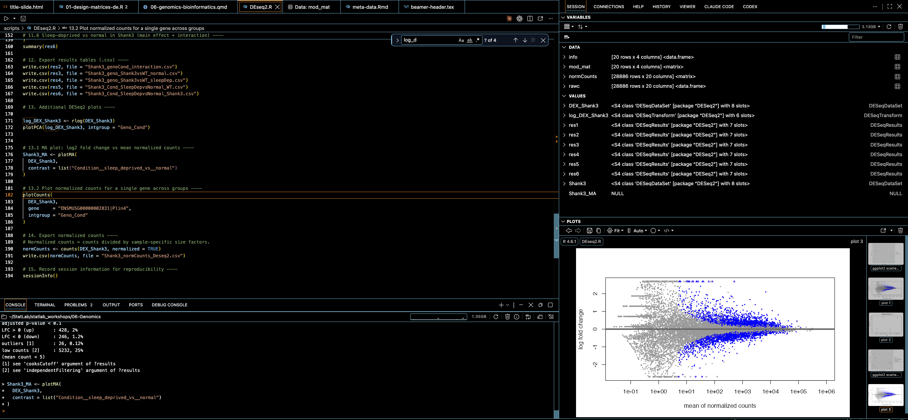
::::

:::: {.column width="45%"}

```{r eval=FALSE, echo=TRUE}
log_DEX_Shank3 <- rlog(DEX_Shank3)
plotMA(log_DEX_Shank3)
```

- **x-axis:** mean of normalized counts
- **y-axis:** $\log_2$ fold change
- **Blue dots:** significantly DE genes ($p_{\text{adj}} < 0.1$)
- Fan at low counts = noisy LFC estimates in low-abundance genes

::::

:::

## Plotting Single Genes: \texttt{plotCounts()}

::: {.columns}

:::: {.column width="58%"}
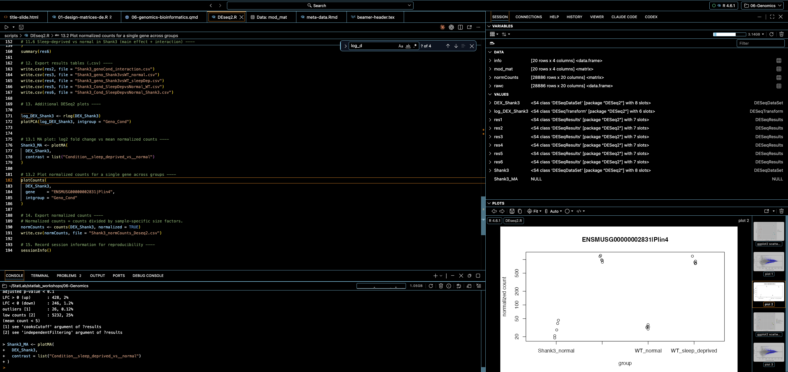
::::

:::: {.column width="42%"}

```{r eval=FALSE, echo=TRUE}
plotCounts(
  DEX_Shank3,
  gene = "ENSMUSG00000002831|Plin4",
  intgroup = "Geno_Cond"
)
```

\vspace{0.4em}

Visualizes normalized counts for a **single gene** split by group. Useful for sanity-checking top DE hits and presenting individual gene results.

::::

:::

## Exporting Normalized Counts

Normalized counts are useful for downstream visualization (heatmaps, clustering) and sharing with collaborators.

```{r eval=FALSE, echo=TRUE}
# Extract normalized counts matrix
normCounts <- counts(DEX_Shank3, normalized = TRUE)

# Save to CSV
write.csv(normCounts, here("results", "Shank3_normCounts_Deseq2.csv"))
```

```{=latex}
\begin{alertblock}{Never Use Normalized Counts for DESeq2 Testing}
Always provide \textbf{raw integer counts} to \texttt{DESeqDataSetFromMatrix()}.
Normalized counts are for visualization and export only.
\end{alertblock}
```

## Resources and Further Reading

- **Law et al. (2020)** --- *F1000Research*: A guide to creating design matrices for gene expression experiments

- **Love, Huber, Anders (2014)** --- *Genome Biology*: the DESeq2 methods paper

- **DESeq2 vignette** --- Bioconductor: comprehensive reference with worked examples

- **Holmes \& Huber (2019)** --- *Modern Statistics for Modern Biology*: free online textbook

- **Bioconductor RNA-seq workflow** --- end-to-end analysis from raw data to results

## Thank You!

::: {.columns}

:::: {.column width="60%"}

Thank you for attending! We'd love your feedback.

\vspace{0.5em}

Scan the QR code to complete a short workshop survey.

::::

:::: {.column width="40%"}


::::

:::
